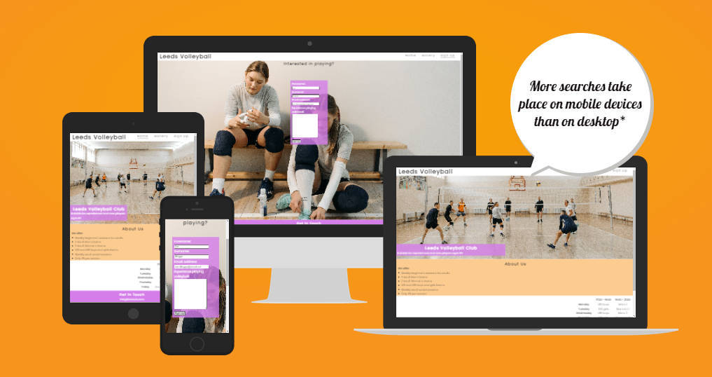
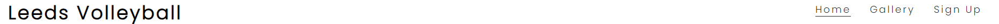
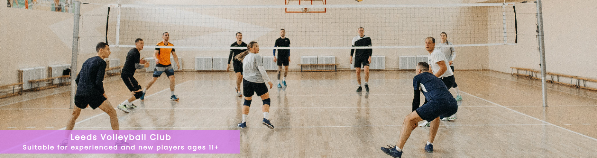
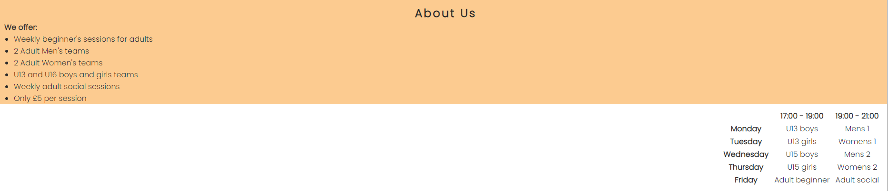
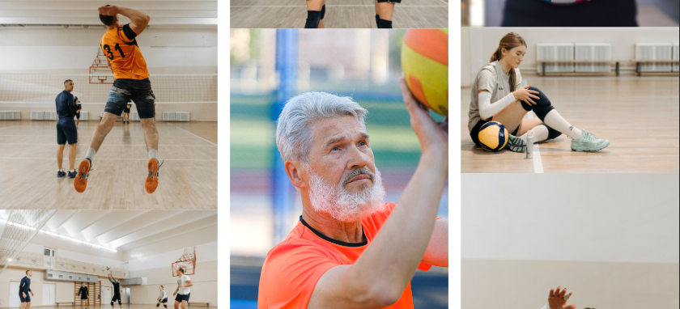
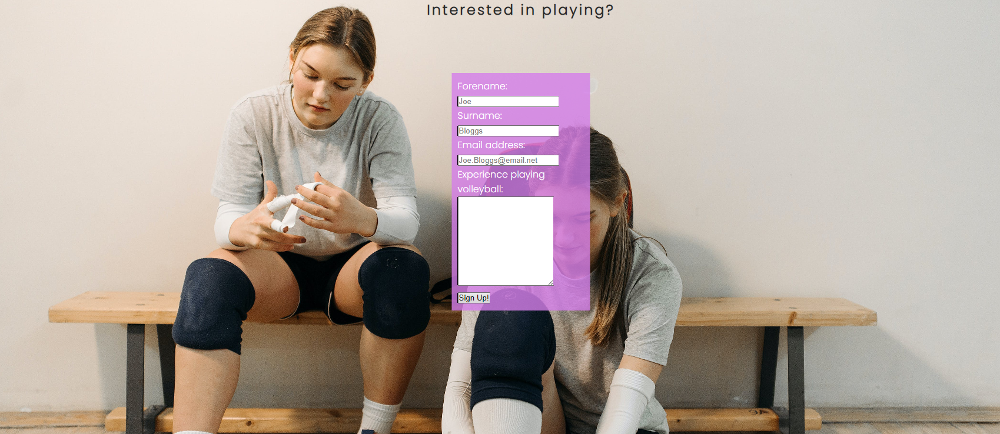

# Leeds Volleyball

The Leeds volleyball website is the best place for anyone aged 11 and up to find information about how to Play volleyball in Leeds.
The club offers beginner sessions and sessions for those looking to play competitively in leagues as part of a team.  
This website enables its' users to find out everything they need to know about how often the club meets and who it's available for, including a sign-up form.

## Features

**- Navigation**

- The top of each page contains a navigation bar showing the club name and logo on the left which links to the home page.
- On the right are links to Home, a gallery of images, and to the sign up page.
- The entire navigation bar is on a white background, with black text for the logo, and dark grey for the links contrasting well.
- The navigation bar lays out the pages and club name clearly, allowing the user to easily locate the information.

**-Header**
- The header is located over the landing page image using the colour of a soft purple, the text being white.
- This advises who the club is suitable for: both beginner and experienced players aged 11aand up.
- The section provides information on who the club is for in a clear, aesthetic way.

**- About Us**
- This section provides information on the sessions available to members, along with times and prices.
- This section clearly lays out important information that a user would need, showing what they offer for who and when.

**- The Gallery**
- This section gives users a look into what the club members get up to and what they can expect.
- The section shows the variety of people involved as well as the variety of play.

**- The Sign Up Page**
- The sign up page has a form to collect information from users who wish to sign up.
- It collects the users full name, email and playing experience, if any.
- This form section permits and encourages the user to sign up to the club so is of great value to them.

**- The Footer**
- This section encourages users to contact the club via email.
- The footer also provides links to the club's facebook, X and instagram pages.
- This section gives the user an opportunity to contact the club or find out further information from their social media.

## Testing
- I tested that this page works in OperaGX, Chrome and Firefox.
- I have verified that the project is responsive, functional and looks good on all the standard screen sizes by using the devtools device toolbar.
- I confirmed that all text in each section is easy to read and understand.
- I have confirmed the forms work and require entries in the necessary fields, the email field will require an email input and the final submit button works.

### Bugs

**Solved bugs**

- When I deployed to GitHub pages, i noticed the social media logo's were not showing up on the Gallery or sign up pages.
- I discovered this was because I had not added the font awesome link to the head on these pages.
- included the link on all head sections, problem cleared.
  
- When I deployed to GitHub pages, I noted that the images on the Gallery were not loading.
- I found that I had used absolute file paths for these images
- I removed the starting / making them relative file paths, solving the problem.

## Validator Testing

* HTML
  - No errors returned when pasing all pages through the official W3C validator
* CSS
  - Mo errors returned when pasing through the official (Jigsaw) validator.
* Accesibility
  - By making use of lighthouse in devtools I have confirmed the colours and fonts are easy to read and accessible.

## Unfixed Bugs

No unfixed Bugs

## Deployment

* The site was deployed to GitHub pages.
  - from the GitHub repository, go to the settings tab
  - from the code and automation section, select pages
  - from the source dropdown section, select deploy from branch
  - from the branch dropdown section, select main branch
  - from here, click save. the page then provides the link to the completed website

the live link can be found here - [Leeds Volleyball](https://lookforluke.github.io/Leeds-Volleyball/index.html)

## Credits

### Content

- The code for the Nav hover/active classes was taken from the CI [Love running](https://learn.codeinstitute.net/courses/course-v1:CodeInstitute+LR101+2021_T1/courseware/4a07c57382724cfda5834497317f24d5/637be1a2e3b84b25aa33f3ab4d98603c/) Project
-  The Code for the Social Media Links was also taken from the CI [Love runnig](https://learn.codeinstitute.net/courses/course-v1:CodeInstitute+LR101+2021_T1/courseware/4a07c57382724cfda5834497317f24d5/e6d4cda2bc08458ba94d2092be9bad3a/)

### Media

- The image on the header, Sign up page and the images in the gallery were taken from [Pexels](https://www.pexels.com/search/volleyball/)
